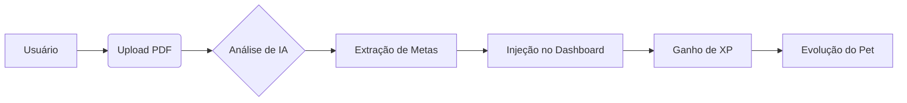

# Blueprint do Produto: NutixoApp 🗺️

Este documento descreve o funcionamento lógico e o "motor" interno da plataforma NutixoApp, servindo de guia para desenvolvedores e arquitetos que desejam estender as funcionalidades do sistema.

---

## ⚙️ O Motor Técnico (The Core Engine)

O NutixoApp opera sobre três pilares reativos principais:

### 1. Sistema de Gamificação (XP Engine)
Gerenciado globalmente via `GamificationContext`.
- **Gatilhos**: Ações do usuário como `UPLOAD_EXAM`, `LOG_MEAL` ou `COMPLETE_CHALLENGE`.
- **Fluxo**: Ação (UI) ➜ `addXP()` ➜ Cálculo de Nível ➜ Atualização do Pet ➜ Feedback (Toast).
- **Gamificação de Dados**: Transformamos métricas de saúde áridas em "combustível" para o Pet Sentinel.

### 2. Pipeline de Processamento de IA
Implementado através do padrão modular `AIAnalysisPage`.
- **Entrada**: Arquivo PDF (Exame/Plano).
- **Processamento**: Extração de biomarcadores via @insforge/sdk ➜ Mapeamento em indicadores CH (Colesterol), GL (Glicose), etc.
- **Saída**: Dados estruturados injetados nos gráficos dinâmicos.

### 3. Design System "Sentinel"
Uma linguagem visual baseada em Dark Mode profundo e neomorfismo suave.
- **Consistência**: Uso de tokens CSS variáveis para garantir que mudanças de tema reflitam em todo o app instantaneamente.
- **Micro-interações**: Cada botão e card possui feedbacks táteis via `framer-motion`.

---

## 🔄 Fluxos de Usuário (User Journeys)

### Jornada do Exame de Sangue

### Jornada do Plano Alimentar
1.  **Input**: Usuário recebe plano do nutricionista.
2.  **Sync**: IA analisa alimentos e gera checklist diário.
3.  **Hábito**: Check no alimento ➜ Incremento de XP ➜ Mudança de Humor do Pet.

---

## 💾 Modelo de Dados e Mocking
Atualmente, o projeto utiliza uma estratégia de **Mocking Centralizado**:
- **Pasta**: `src/data/mocks/`
- **Contratos**: Dados reais simulados para permitir desenvolvimento de UI sem dependência de API ativa.
- **Persistência**: Via `Local Storage` para manter o progresso do Pet e XP entre sessões de navegação.

---

## 🏗️ Padrões de Componentização
- **Atomic-ish**: Componentes base em `/common`.
- **Compound Components**: Telas complexas divididas em `Header`, `MainArea`, `ResultSidebar`.
- **Hooks-First**: Toda a lógica de negócio pesada vive em `hooks/` ou `contexts/`.

---
*Assuntos relacionados à implantação podem ser consultados em:*
👉 [DEPLOYMENT.md](./DEPLOYMENT.md)
