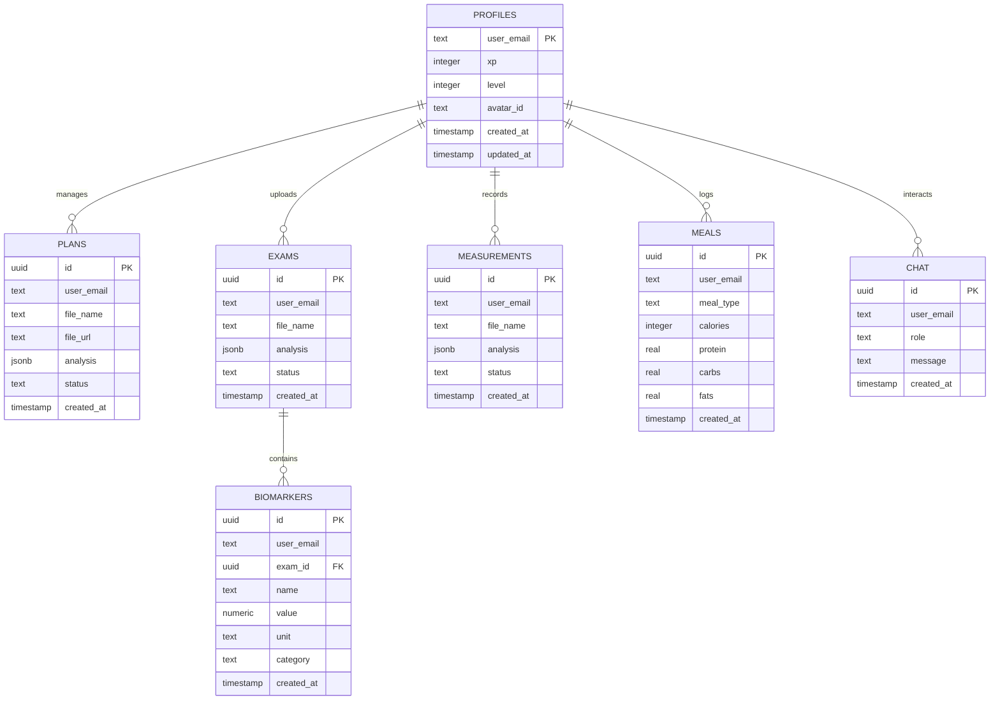

# 🗄️ Estrutura do Banco de Dados - Nutrixo

Este documento descreve a organização das tabelas no backend Insforge, detalhando colunas, tipos e relacionamentos do projeto Nutrixo.

## 📊 Diagrama de Entidade-Relacionamento (ERD)

---

## 📝 Detalhamento das Tabelas

### 1. `nutrixo_profiles`
Armazena os dados de gamificação e personalização do usuário.
- **user_email (PK)**: E-mail do usuário (vínculo principal).
- **xp**: Pontuação total acumulada.
- **level**: Nível atual no sistema.
- **avatar_id**: Identificador da evolução do pet (ovo, bebê, etc).

### 2. `nutrixo_plans`
Registros de Planos Alimentares enviados via PDF.
- **analysis (jsonb)**: Contém o parsing completo feito pela IA (metas de macros, recomendações).

### 3. `nutrixo_exams`
Histórico de uploads de arquivos de bioimpedância ou exames laboratoriais.

### 4. `nutrixo_measurements`
Registros de medidas corporais (circunferências, peso) extraídos de PDFs ou inseridos manualmente.

### 5. `nutrixo_meals`
Diário alimentar do usuário.
- **calories, protein, carbs, fats**: Valores nutricionais extraídos da descrição ou imagem pela IA.

### 6. `nutrixo_biomarkers`
Dados granulares extraídos dos exames.
- **exam_id (FK)**: Aponta para o arquivo original em `nutrixo_exams`.
- **reference_range**: Faixa de referência do laboratório para comparação.

### 7. `nutrixo_chat`
Histórico de interações com a IA assistente para manter o contexto das conversas.

---

> [!NOTE]
> Todas as tabelas possuem **RLS (Row Level Security)** ativo, garantindo que usuários autenticados só possam ler/escrever registros vinculados ao seu próprio `user_email`.
