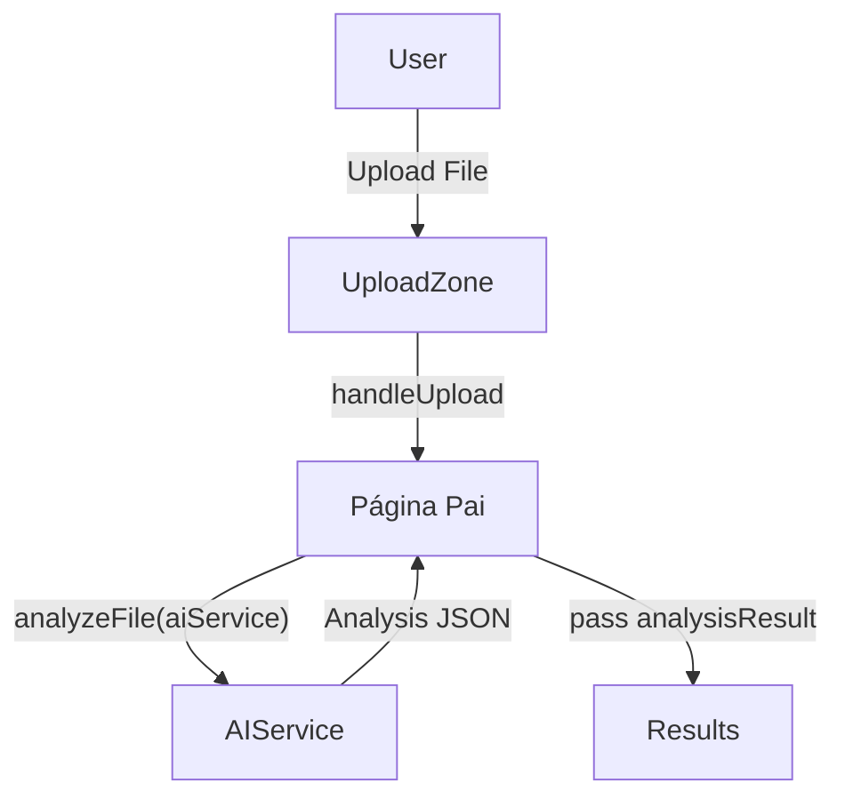

# Design: Padrão de Importação e Análise de PDFs com IA

**Data**: 2026-02-13  
**Status**: Aprovado  
**Autor**: Antigravity

## Objetivo
Padronizar a interface de upload e análise de documentos (PDF/DOCX) em todo o aplicativo Nutrixo, utilizando um único componente base que garanta consistência visual premium e facilidade de manutenção.

## Motivação
Atualmente, as páginas `Labs.jsx`, `Measurements.jsx` e `NutritionPlan.jsx` possuem códigos quase idênticos para gerenciar o upload, o estado de análise da IA e a exibição de avisos legais. O padrão de composição permitirá reaproveitar essa lógica e estilo, mantendo a flexibilidade para diferentes layouts de resultados.

## Arquitetura: Padrão de Composição (Compound Components)

Utilizaremos um componente pai `AIAnalysisPage` que compartilha seu estado interno (via context ou props) com sub-componentes específicos.

### Componentes

1.  **AIAnalysisPage (Root)**: Container principal que centraliza a lógica de animação (`framer-motion`) e o estado (`isAnalyzing`, `error`, `uploadedFile`).
2.  **AIAnalysisPage.Header**: Renderiza o ícone (Lucide), título e descrição com o gradiente correto.
3.  **AIAnalysisPage.UploadZone**: Área tracejada para drop de arquivos e botão de seleção.
4.  **AIAnalysisPage.Loading**: Feedback visual de progresso da IA.
5.  **AIAnalysisPage.Error**: Tratamento de exceções e botão de retry.
6.  **AIAnalysisPage.Results**: Wrapper animado que só aparece após o sucesso da análise.
7.  **AIAnalysisPage.Disclaimer**: Termo de responsabilidade fixo (Aviso Importante).

## Data Flow

## Verificação
- [ ] O componente deve ser responsivo.
- [ ] Deve suportar diferentes gradientes de fundo no cabeçalho.
- [ ] A transição entre estados (Upload -> Loading -> Results) deve ser suave.
